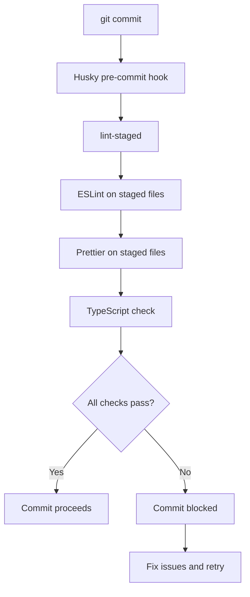

# Pre-commit Hooks and Quality Checks

This document describes the automated quality checks and pre-commit hooks used in the Code Audit MCP project.

## Overview

The project uses a combination of tools to ensure code quality:

- **Husky**: Git hooks management
- **lint-staged**: Run checks only on staged files
- **ESLint**: JavaScript/TypeScript linting
- **Prettier**: Code formatting
- **TypeScript**: Type checking

## Pre-commit Hook Flow

When you run `git commit`, the following happens automatically:



## Configuration Files

### Husky Configuration

Located in `.husky/pre-commit`:

```bash
npx lint-staged
```

### lint-staged Configuration

In `package.json`:

```json
{
  "lint-staged": {
    "*.{ts,js}": [
      "eslint --fix",
      "prettier --write",
      "bash -c 'npm run type-check'"
    ],
    "*.{json,md}": ["prettier --write"]
  }
}
```

### ESLint Configuration

In `eslint.config.js`:

- Uses flat config format
- TypeScript-specific rules
- Allows console for CLI tools
- Ignores build and dependency directories

### Prettier Configuration

In `.prettierrc`:

```json
{
  "semi": true,
  "trailingComma": "es5",
  "singleQuote": true,
  "printWidth": 80,
  "tabWidth": 2,
  "useTabs": false,
  "endOfLine": "lf"
}
```

## Manual Quality Checks

### Running All Checks

```bash
# Run all quality checks (no fixes)
npm run quality-check

# This runs:
# - npm run lint
# - npm run format:check
# - npm run type-check
```

### Fixing Issues Automatically

```bash
# Fix all auto-fixable issues
npm run quality-fix

# This runs:
# - npm run lint:fix
# - npm run format
```

### Individual Checks

```bash
# ESLint only
npm run lint          # Check only
npm run lint:fix      # Check and fix

# Prettier only
npm run format:check  # Check only
npm run format        # Format all files
npm run format:src    # Format source files only

# TypeScript only
npm run type-check    # Type check without building
```

## Common Issues and Solutions

### 1. ESLint Errors

**Issue**: ESLint reports errors that block commit

**Solution**:

```bash
# View all ESLint errors
npm run lint

# Auto-fix what's possible
npm run lint:fix

# Fix remaining issues manually
```

**Common ESLint errors**:

- `no-unused-vars`: Remove or use the variable
- `@typescript-eslint/no-explicit-any`: Use specific types instead of `any`
- Missing semicolons: Auto-fixed by `lint:fix`

### 2. Prettier Formatting

**Issue**: Prettier reports formatting issues

**Solution**:

```bash
# Check formatting issues
npm run format:check

# Auto-format all files
npm run format
```

**Common formatting issues**:

- Incorrect indentation
- Missing trailing commas
- Wrong quote style
- Line length exceeds limit

### 3. TypeScript Errors

**Issue**: Type checking fails

**Solution**:

```bash
# See all TypeScript errors
npm run type-check

# Common fixes:
# - Add missing type annotations
# - Fix type mismatches
# - Import missing types
```

### 4. Pre-commit Hook Fails

**Issue**: Commit is blocked by pre-commit hook

**Solution**:

```bash
# Option 1: Fix all issues
npm run quality-fix
git add .
git commit -m "your message"

# Option 2: Debug specific file
npx eslint path/to/file.ts
npx prettier --check path/to/file.ts

# Option 3: Emergency bypass (NOT RECOMMENDED)
git commit -m "your message" --no-verify
```

## Bypassing Hooks (Emergency Only)

In rare cases where you need to bypass hooks:

```bash
# Bypass pre-commit hooks
git commit --no-verify -m "emergency fix"

# Or using shorthand
git commit -n -m "emergency fix"
```

**WARNING**: Only bypass hooks in emergencies. Always fix issues afterward.

## Setting Up Hooks in a New Clone

Hooks are automatically set up when you run `npm install` thanks to the `prepare` script:

```json
{
  "scripts": {
    "prepare": "husky"
  }
}
```

If hooks aren't working:

```bash
# Reinstall husky
npm run prepare

# Verify hooks are installed
ls -la .husky/
```

## IDE Integration

### VS Code

With recommended extensions installed, you get:

- Real-time ESLint feedback
- Format on save with Prettier
- TypeScript errors inline

Settings in `.vscode/settings.json`:

```json
{
  "editor.formatOnSave": true,
  "editor.codeActionsOnSave": {
    "source.fixAll.eslint": "explicit"
  }
}
```

### Other IDEs

Configure your IDE to:

1. Use project ESLint configuration
2. Use project Prettier configuration
3. Enable format on save
4. Show TypeScript errors

## Best Practices

### 1. Commit Often

- Make small, focused commits
- Run checks before committing
- Don't accumulate large changes

### 2. Fix Issues Immediately

- Don't ignore linting errors
- Keep code formatted consistently
- Address type errors promptly

### 3. Configure Your Editor

- Enable format on save
- Show linting errors inline
- Use TypeScript language service

### 4. Run Checks Before Push

```bash
# Before pushing changes
npm run quality-check
npm test
```

## Customizing Checks

### Adding New File Types

To add checks for new file types, update `lint-staged` in `package.json`:

```json
{
  "lint-staged": {
    "*.{ts,js}": ["..."],
    "*.{yml,yaml}": ["prettier --write"]
  }
}
```

### Modifying ESLint Rules

Edit `eslint.config.js` to add or modify rules:

```javascript
export default [
  {
    rules: {
      // Add custom rules
      'no-console': 'warn',
      '@typescript-eslint/explicit-return-type': 'error',
    },
  },
];
```

### Changing Prettier Settings

Modify `.prettierrc`:

```json
{
  "printWidth": 100, // Change line width
  "semi": false, // Remove semicolons
  "singleQuote": true // Use single quotes
}
```

## Troubleshooting

### Hooks Not Running

```bash
# Check if husky is installed
ls -la .husky/

# Reinstall husky
rm -rf .husky
npm run prepare

# Verify git hooks
git config core.hooksPath
```

### Conflicting Formatters

If you have multiple formatters:

1. Disable other formatters in your IDE
2. Use only project Prettier
3. Check `.editorconfig` conflicts

### Performance Issues

If checks are slow:

```bash
# Check what's being processed
npx lint-staged --debug

# Consider:
# - Adding more specific patterns
# - Excluding large files
# - Running checks in parallel
```

## Continuous Integration

The same checks run in CI to ensure code quality:

```yaml
# Example GitHub Actions workflow
- name: Quality Checks
  run: |
    npm ci
    npm run quality-check
    npm test
```

This ensures that:

- All PRs meet quality standards
- Main branch stays clean
- Consistent code style across contributors
